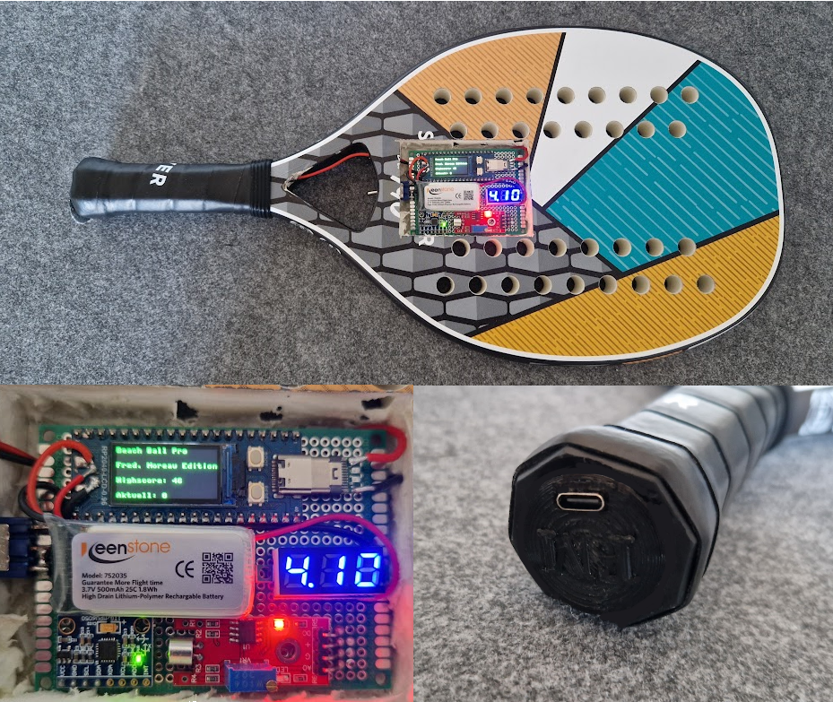

# BeachBallPro
MicroPython Project with the RP2040-LCD module to count hits in a beach ball game.
I built this as a present for a good friend.

## Features

- Counting how often a ball got hit (increments by 2)
- Highscore which is saved on flash
- Using mpu6050 gyroscope / accelerometer and ky-038 sound module to detect ball hits
- Charging via USB type C in handle
- 500 mAh lipo battery

## How it works

- KY-038 sound module as acoustic trigger
- If acoustically triggered, checks with gyroscope if force was detected at that time, too (in order to minimize false positives)
- Increases hits by 2 (implying there are two parties playing with each other)
- Displays current hits on display
- In case current hits > highscore, highscore is increased on the display as well

## Components

- RP2040-LCD-0.96-M (Processing unit running micropython, including display and lipo charger)
- MPU6050 accelerometer / gyroscope
- KY-038 sound detection module
- Switch
- USB-C male + female for charging
- 7 segment voltage display
- 500 mAh lipo battery
- Wires

## Wiring

- MPU6050:
    - SCL: GP21
    - SDA: GP20
- KY-038:
    - A0: GP26
    - D0: GP22